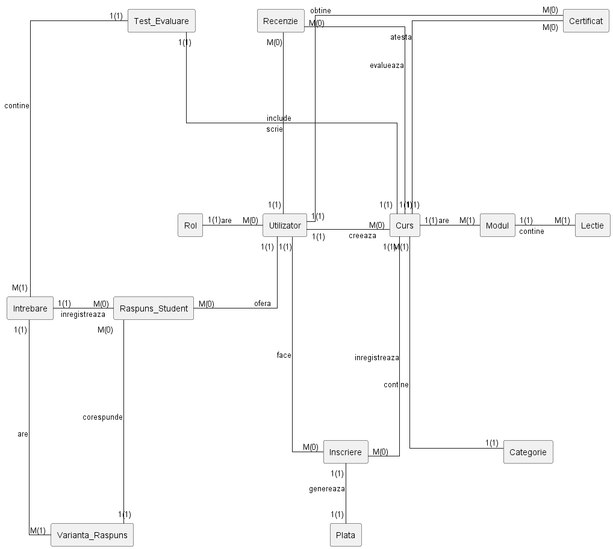
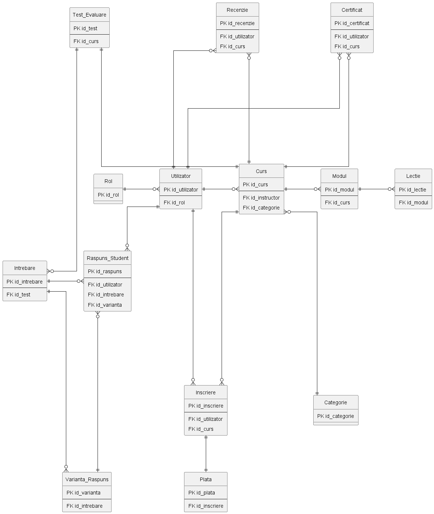

# Proiect Baze de Date: Platformă de E-Learning

Acest proiect modelează o platformă educațională online (tip Udemy/Coursera), realizat pentru cursul de Baze de Date. 

## 1. Descrierea modelului real, a utilității acestuia și a regulilor de funcționare

**Descrierea și utilitatea modelului**
* Scopul principal al aplicației este de a facilita interacțiunea dintre instructori și studenți prin intermediul cursurilor digitale. Din punct de vedere al utilității, sistemul oferă un mediu centralizat pentru gestionarea eficientă a conținutului educațional, a conturilor de utilizator, a procesului de evaluare și a tranzacțiilor financiare. 

**Reguli generale de funcționare**
* **Instructorii** pot crea cursuri, pe care le încadrează în categorii specifice. Conținutul este structurat logic în module și lecții. De asemenea, ei pot concepe teste de evaluare pentru a verifica cunoștințele cursanților.
* **Studenții** se pot înscrie la aceste cursuri, acțiune care generează automat o înregistrare a plății. Ei pot parcurge materialele, susține teste și lăsa recenzii.
* La finalizarea cursului și promovarea testului de evaluare, platforma emite automat un certificat nominal de absolvire.

## 2. Prezentarea constrângerilor (restricții, reguli) impuse asupra modelului

Pentru a menține corectitudinea și integritatea bazei de date, modelul respectă următoarele constrângeri stricte:

* Un utilizator se identifică unic prin adresa de email și trebuie să aibă un rol obligatoriu (ex. student, instructor) la crearea contului.
* Prețul unui curs și valoarea unei plăți trebuie să fie strict pozitive (> 0).
* Pentru a menține relevanța evaluărilor, un student nu poate lăsa o recenzie pentru un curs la care nu are o înscriere activă.
* O recenzie poate avea un rating limitat strict la o valoare între 1 și 5.
* Orice curs creat trebuie să aparțină obligatoriu unei categorii. O categorie rămâne în sistem doar dacă conține cel puțin un curs.
* Ierarhia conținutului: Un curs aprobat trebuie să conțină cel puțin un modul, un modul trebuie să aibă cel puțin o lecție, iar testul de evaluare atașat necesită minim o întrebare cu variante de răspuns.
* Orice înscriere în platformă generează în mod automat și obligatoriu o singură înregistrare de plată (relație 1:1).
* Un curs nou creat poate exista în baza de date având în momentul inițial 0 înscrieri, 0 recenzii și 0 certificate emise.
* Un test de evaluare este promovat doar dacă scorul obținut de student este mai mare sau egal cu scorul minim setat de instructor.
* Relație de grad superior (>2): Sistemul înregistrează răspunsurile la teste printr-o relație ternară. Când un student rezolvă un test, tabelul asociativ `Raspuns_Student` leagă simultan 3 entități: utilizatorul care răspunde, întrebarea la care se răspunde și varianta de răspuns aleasă.

## 3. Diagrama ERD (Entity-Relationship Diagram)
Această diagramă reprezintă modelul conceptual de nivel înalt al aplicației. Am utilizat notația Chen (min-max) pentru a ilustra relațiile, iar cheile primare sunt marcate cu simbolul diez (#). De remarcat este relația de grad superior (>2), reprezentată vizual printr-un hexagon central, care conectează simultan 3 entități distincte (`Utilizator`, `Intrebare` și `Varianta_Raspuns`) pentru a înregistra interacțiunea studentului cu testele.   

## 4. Diagrama Conceptuală (Modelul Relațional)
Această diagramă detaliază structura fizică a bazei de date (14 tabele) folosind notația Crow's Foot. Modelul este proiectat direct în Forma Normală 3 (FN3) și, pentru claritate vizuală, expune exclusiv cheile primare (PK) și cele străine (FK). Relațiile complexe de tip Many-to-Many și relația ternară au fost rezolvate prin tabele associative, precum `Inscriere`, `Recenzie` sau `Raspuns_Student`.

